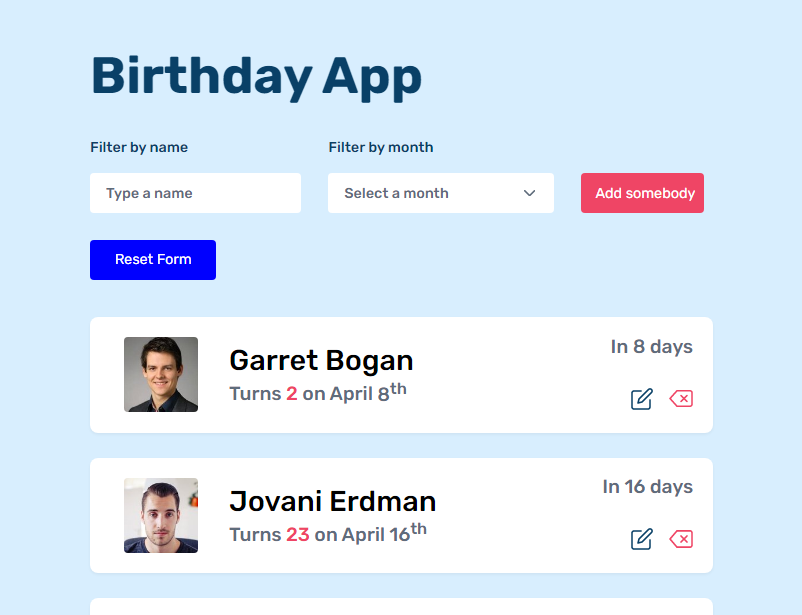
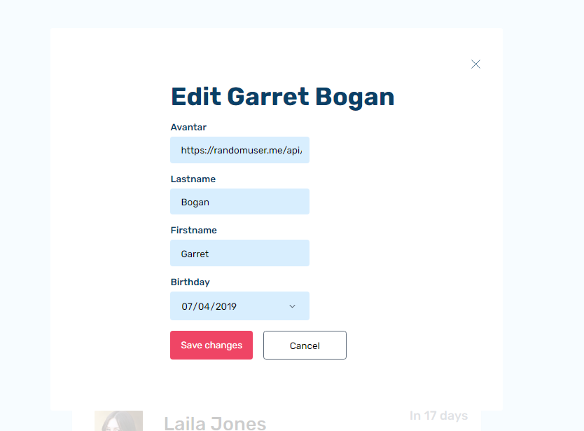
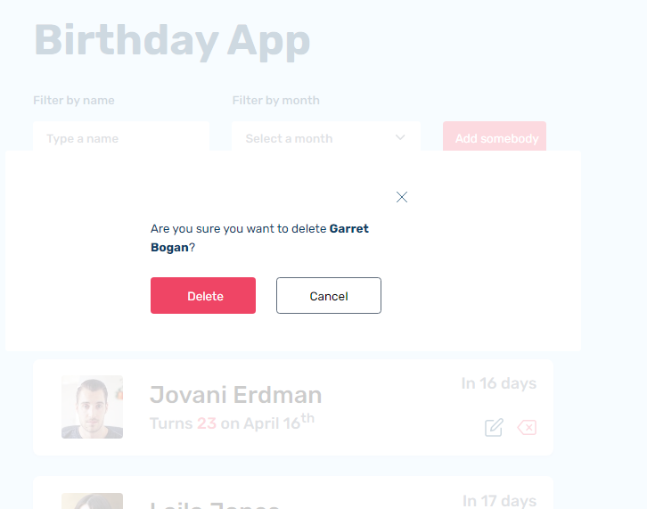

# Birthday App

In this project, all I need is that showing a list of people sorted by the soonest birthday.
 - I have a file in the project called `person.json`. Which contains lists of peole. That's what I need to use.
- Users can make changes to the design such as editing an item from the list.
- All the changes will be saved on the local storage.
- All the list is sorted by the soonest birthday date.
 -  Also, you can search for people by typing their name (Firstname or lastname) and month of birth. But you can reset that search.

## Technology
- I built it with ***Vanilla JavaScript***, ***HTML5***, and ***CSS***.

## Design
- You can find the design: 
 - 
 - 
 - 
 - Online at [figma.com/birthday-app](https://www.figma.com/file/bb1Mie5R3mUhR77PtGG8bJ/Birthday-App?node-id=0%3A1)

 ## Prerequisites:

 If you want to use this code. Fork then clone it to your local computer. If you haven't installed parcel globally, then you need to install it otherwise change some logic in the `package.json`.

These are the steps if you have to follow: 

```bash
# Clone this repository to your local computer
$ git clone https://github.com/vakodrazan/birthday-app

# Install dependencies
$ npm install

# Run the app
$ npm start or $ parcel index.html
```